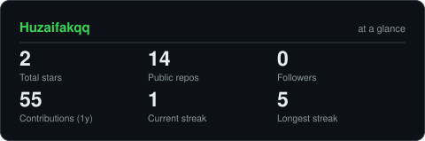
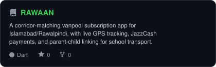
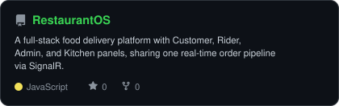
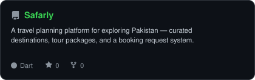
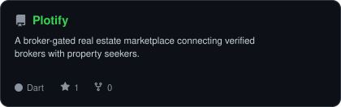

<div align="center">

<!-- PORTRAIT - generated by scripts/dotify.py from assets/me.jpeg.
     Colour mode, so one file serves both GitHub themes. Regenerate with:
       python scripts/dotify.py assets/me.jpeg -o assets/portrait \
         --cols 100 --equalize --detail 0.5 --color -->


<br>

<!-- NAME / TAGLINE - animated typing -->
<a href="https://github.com/Huzaifakqq">
  
</a>

<br>

<!-- SOCIALS -->
<a href="https://linkedin.com/in/huzaifakashif"></a>
<a href="mailto:huzaifakqq5@gmail.com"></a>
<!-- TODO: add Portfolio badge once vercel site is live -->
<!-- <a href="YOUR_PORTFOLIO_URL"></a> -->


</div>

---

## `~/` whoami

```console
$ cat about.txt
```

Hi, I'm **Huzaifa Kashif**. I build Flutter apps and ASP.NET backends for a living,
and I run a clothing brand on the side because one obsession was never enough.

- Currently building **[RAWAAN](https://github.com/Huzaifakqq/RAWAAN)** — a corridor-matching vanpool app for Islamabad/Rawalpindi
- Founder of **Chapter Dresses** — a women's clothing brand across Instagram and Facebook
- Learning **scalable backend architecture & AI-powered content workflows**
- Fun fact: **I once ran a 17K-follower Urdu poetry page before pivoting it into a dev journal**

<br>

<div align="center">

## `~/` toolbox


</div>

---

<div align="center">

## `~/` skill radar

<table>
<tr>
<td width="50%" align="center" valign="middle">

<!-- Self-rated radar - edit assets/skills.json, the workflow redraws it -->
<picture>
  <source media="(prefers-color-scheme: dark)"  srcset="assets/radar-dark.svg">
  <source media="(prefers-color-scheme: light)" srcset="assets/radar-light.svg">
  
</picture>

</td>
<td width="50%" align="center" valign="middle">

<!-- Live radar built from real language byte counts across your repos -->
<picture>
  <source media="(prefers-color-scheme: dark)"  srcset="assets/radar-langs-dark.svg">
  <source media="(prefers-color-scheme: light)" srcset="assets/radar-langs-light.svg">
  
</picture>

</td>
</tr>
</table>

</div>

---

<div align="center">

## `~/` contribution calendar

<!-- 3D isometric calendar, regenerated every 6h by .github/workflows/metrics.yml -->


<br><br>

<!-- Snake eats the contribution graph - .github/workflows/snake.yml -->
<picture>
  <source media="(prefers-color-scheme: dark)"  srcset="https://raw.githubusercontent.com/Huzaifakqq/Huzaifakqq/output/snake-dark.svg">
  <source media="(prefers-color-scheme: light)" srcset="https://raw.githubusercontent.com/Huzaifakqq/Huzaifakqq/output/snake.svg">
  
</picture>

</div>

---

<div align="center">

## `~/` the numbers

<!-- Generated by scripts/cards.py into this repo. Deliberately NOT
     github-readme-stats / streak-stats / github-profile-trophy: those are
     shared public instances that go down and take the whole section with them. -->
<picture>
  <source media="(prefers-color-scheme: dark)"  srcset="assets/card-stats-dark.svg">
  <source media="(prefers-color-scheme: light)" srcset="assets/card-stats-light.svg">
  
</picture>

<br>


<br><br>


</div>

---

<div align="center">

## `~/` selected work

<!-- Cards generated by scripts/cards.py from assets/projects.json.
     Stars, forks and language are pulled live from the API on every run. -->
<table>
<tr>
<td width="50%">
  <a href="https://github.com/Huzaifakqq/RAWAAN">
    <picture>
      <source media="(prefers-color-scheme: dark)"  srcset="assets/card-RAWAAN-dark.svg">
      <source media="(prefers-color-scheme: light)" srcset="assets/card-RAWAAN-light.svg">
      
    </picture>
  </a>
</td>
<td width="50%">
  <a href="https://github.com/Huzaifakqq/RestaurantOS">
    <picture>
      <source media="(prefers-color-scheme: dark)"  srcset="assets/card-RestaurantOS-dark.svg">
      <source media="(prefers-color-scheme: light)" srcset="assets/card-RestaurantOS-light.svg">
      
    </picture>
  </a>
</td>
</tr>
<tr>
<td width="50%">
  <a href="https://github.com/Huzaifakqq/Safarly">
    <picture>
      <source media="(prefers-color-scheme: dark)"  srcset="assets/card-Safarly-dark.svg">
      <source media="(prefers-color-scheme: light)" srcset="assets/card-Safarly-light.svg">
      
    </picture>
  </a>
</td>
<td width="50%">
  <a href="https://github.com/Huzaifakqq/Plotify">
    <picture>
      <source media="(prefers-color-scheme: dark)"  srcset="assets/card-Plotify-dark.svg">
      <source media="(prefers-color-scheme: light)" srcset="assets/card-Plotify-light.svg">
      
    </picture>
  </a>
</td>
</tr>
</table>

<sub>

| project | stack |
|---|---|
| **[RAWAAN](https://github.com/Huzaifakqq/RAWAAN)** | `Flutter` `ASP.NET Web API` `SQL Server` |
| **[RestaurantOS](https://github.com/Huzaifakqq/RestaurantOS)** | `Flutter` `ASP.NET` `SignalR` |
| **[Safarly](https://github.com/Huzaifakqq/Safarly)** | `Flutter` `ASP.NET Web API` `SQL Server` |
| **[Plotify](https://github.com/Huzaifakqq/Plotify)** | `Flutter` `ASP.NET Web API` `SQL Server` |

</sub>

</div>

---

<div align="center">

<sub>`01100011 01101111 01100100 01100101`</sub>

</div>